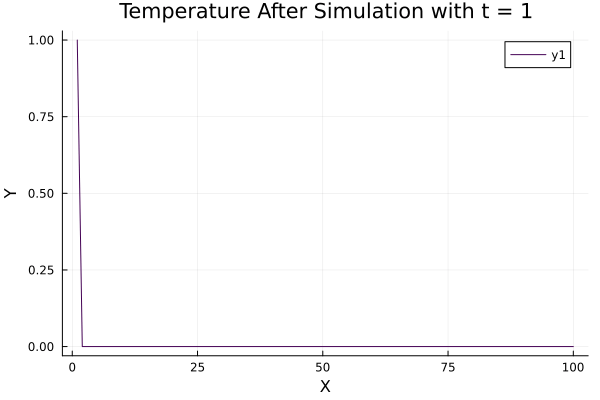
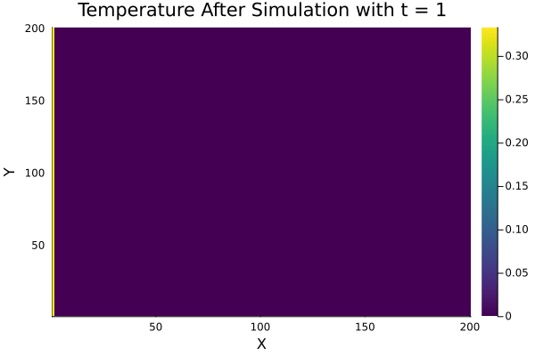

# D2Q9 Fluid Simulation Study Project

## Overview

This is a study project focused on simulating fluid dynamics using lattice Boltzmann methods. It utilizes OpenCL for parallel computation and includes tests using Google Test (gtest).

## Goals and Progress

### Completed

- Diffusion

- Advection - Diffusion

### In Progress

- BounceBackBoundary

- OpenBoundary

- Non-Isothermal Incompressible Fluid Flow

## Dependency

- C++17
- QT 6.5
- OpenCL 3
- OpenMP

## Sample Results

## Notes

This project is primarily for study purposes. While it is not designed for production use, feedback, issue reports, and recommendations are welcome.